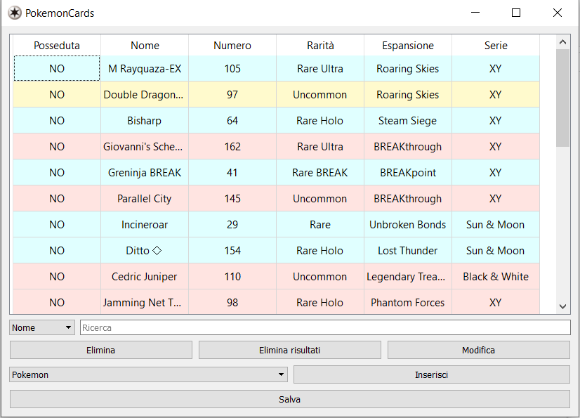
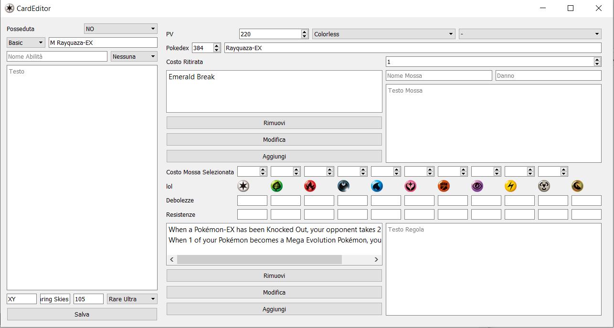

# Progetto Programmazione ad Oggetti, "PokemonCards"

Progetto per il corso di Programmazione ad Oggetti per la laurea triennale in Informatica presso [Università degli Studi di Padova](https://www.unipd.it/), estate 2019.

Il progetto vuole andare a creare un programma con il quale l'utente può gestire la propria
collezione di carte GCC Pokémon man mano che escono nuove espansioni.
PokémonCards permette all'utente di aprire e modificare carte già esistenti o inserirne di nuove e salvarle su file. Inoltre gli permette di indicare per ogni carta se è in suo possesso oppure no in modo da tenere traccia facilmente della sua collezione

## Descrizione Progetto

*(per la descrizione completa vedi* [relazione](relazione/relazione.pdf)*)*

È stato scelto di rendere compatibile il progetto con l'API disponibile al sito [Pokémon TCG Developers](https://pokemontcg.io/) in modo da poter importare facilmente nuove espansioni che escono, per mantenere così il programma sempre al passo con l'uscita di nuove espansioni (ma non viceversa riesportare con tutti i campi ancora pieni perché alcuni campi non utili come ad esempio il disegnatore vengono tralasciati). Di conseguenza dato che l'API restituisce documenti in formato json, la scelta è ricaduta sulla libreria [nlohmann/json](https://github.com/nlohmann/json).

## Tecnologie utilizzate

- C++
- QT 5.9.5
- Qt Creator: 4.8.1